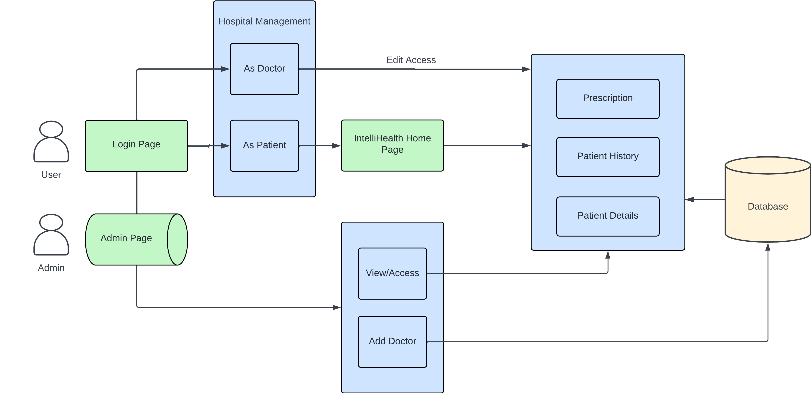
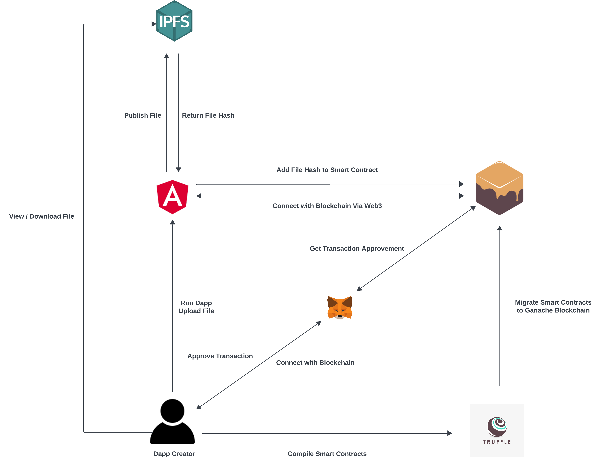

# Intellihealth

A Blockchain-Based Electronic Health Record (EHR) System 

## Tech Stack:

## Purpose

We aim to implement a decentralized blockchain-based architecture to
enhance data security, privacy, and immutability of patient health
records.

## Findings

1. Physical Documents are tedious to read and carry.

2. Digitization through blockchain provides security.

## Flowchart

## Layout

